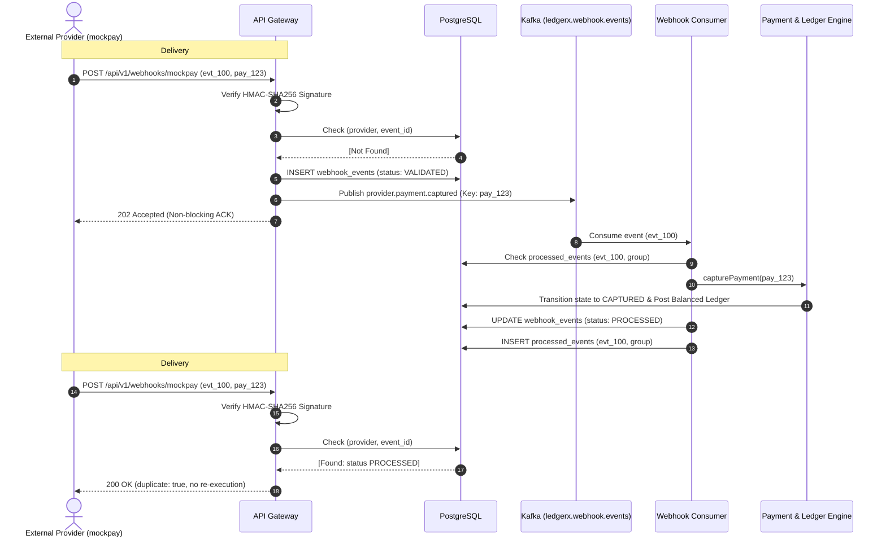

LedgerX is a payment infrastructure and financial reconciliation platform that models reliable payment processing, double-entry accounting, risk evaluation, webhook handling, and automated settlement workflows.

It is designed around financial correctness and distributed-systems principles, including double-entry bookkeeping, idempotency, concurrency control, asynchronous event processing, reconciliation, and observability.

Note: LedgerX is an infrastructure sandbox and engineering platform. It does not process real-world monetary transactions directly. Real payment processing would require integration with an external payment provider.

---

## 1. System Architecture Overview

```text
                         LedgerX
                            │
                       API Gateway
                            │
          ┌─────────────────┼─────────────────┐
          ↓                 ↓                 ↓
   Payment Service     Ledger Service     Risk Engine
          │                 │                 │
          └─────────────────┼─────────────────┘
                            ↓
                       PostgreSQL
                            │
                 ┌──────────┴──────────┐
                 ↓                     ↓
               Redis                 Outbox
                                       │
                                       ↓
                                     Kafka
                                       │
                 ┌─────────────────────┼─────────────────┐
                 ↓                     ↓                 ↓
            Webhooks               Risk Events      Settlement
                                                           │
                                                           ↓
                                                    Reconciliation
                                                           │
                                                           ↓
                                                     Settlement
```

---

## 2. Double-Entry Accounting Core (Milestone 3)

The fundamental financial principle of LedgerX is that every financial transaction produces balanced, immutable ledger entries:

$$\sum \text{Debits} = \sum \text{Credits}$$

### Financial Transaction Flow

```text
Payment
   │
   ↓
Payment Service
   │ (Payment Capture Transition: AUTHORIZED -> CAPTURED)
   ↓
Ledger Service
   │
   ├── Ledger Transaction (Type: CAPTURE, Reference: PAYMENT:id)
   │       ├── Debit:  Merchant Settlement Receivable (Asset)  +₹100
   │       └── Credit: Platform Payment Clearing      (Clearing) +₹100
   │
   ↓
PostgreSQL (Transactionally coordinated & balanced)
```

### Financial Invariants Enforced
1. **Double-Entry Balance Invariant**:
   Every ledger transaction must contain at least two entries and verify `SUM(debits) == SUM(credits)`. If unbalanced, the transaction is rejected and rolls back completely with `FinancialInvarianceError`.
2. **Append-Only Immutability**:
   Historical ledger records are append-only. There are no `UPDATE` or `DELETE` endpoints. Any financial adjustment or correction must be posted as a new compensating transaction.
3. **Reference Idempotency & Uniqueness**:
   A PostgreSQL database constraint `UNIQUE (reference_type, reference_id)` prevents the same business event (e.g. payment capture) from creating duplicate ledger entries.
4. **Zero-Float Money Representation**:
   All monetary amounts are strictly represented in integer minor units (`amountMinor` as `bigint` in TypeScript and `BIGINT` in PostgreSQL). For example: ₹100.00 is stored as `10000n` with currency `'INR'`.
5. **Positive Amount Constraint**:
   All entries enforce `amount_minor > 0` at both application and database level (`CHECK (amount_minor > 0)`).
6. **Dynamic Balance Derivation**:
   Account balances are not stored as mutable numbers; they are derived dynamically from the historical journal entries:
   - **Asset & Expense** accounts carry a **Debit Normal Balance** ($\text{Debits} - \text{Credits}$).
   - **Liability, Equity, Revenue & Clearing** accounts carry a **Credit Normal Balance** ($\text{Credits} - \text{Debits}$).

---

---

## 3. Idempotency Architecture (Milestone 4)

In distributed financial systems, network timeouts, client retries, and duplicate submissions can lead to severe issues like double charging or duplicate refunds. LedgerX enforces **authoritative idempotency** for all state-mutating financial APIs (`POST /api/v1/payments`, `POST /api/v1/payments/:id/capture`, `POST /api/v1/payments/:id/refund`).

Clients pass a unique header:
```http
Idempotency-Key: <unique-key>
```

### Deterministic Request Hashing
To prevent key hijacking or accidental reuse with differing parameters, LedgerX computes a deterministic SHA-256 hash using a canonical representation of the HTTP method, URL path, and JSON payload (with keys sorted recursively):
```text
request_hash = SHA256(method + ":" + path + ":" + canonical_json_sort(body))
```

If a client attempts to reuse an existing idempotency key with a different payload, LedgerX immediately rejects the request with HTTP 409 `IDEMPOTENCY_KEY_REUSED`.

### Idempotency Lifecycle & Protocol Flow

```text
Client                         Idempotency Middleware          Core Financial Engine          PostgreSQL
  │                                      │                               │                        │
  │── POST with Idempotency-Key ─────────>│                               │                        │
  │                                      │── Compute Canonical SHA-256 ──>│                        │
  │                                      │── Query key in database ───────────────────────────────>│
  │                                      │<── [Key Not Found] ────────────────────────────────────│
  │                                      │── Lock key as IN_PROGRESS ─────────────────────────────>│
  │                                      │                               │                        │
  │                                      │── Execute Financial Op ───────>│                        │
  │                                      │                               │── BEGIN TX ───────────>│
  │                                      │                               │   Update Status        │
  │                                      │                               │   Post Balanced Ledger │
  │                                      │                               │── COMMIT TX ──────────>│
  │                                      │<── Financial Result ──────────│                        │
  │                                      │── Persist Result (COMPLETED) ──────────────────────────>│
  │<── 201 Created (Original Response) ──│                                                        │
  │                                      │                                                        │
  │   --- Subsequent Retry ---           │                                                        │
  │── POST with Same Idempotency-Key ────>│                                                        │
  │                                      │── Check key & request_hash ────────────────────────────>│
  │                                      │<── Match Found (COMPLETED) ────────────────────────────│
  │<── 201 Created ──────────────────────│                                                        │
  │   Header: x-idempotency-replayed: true                                                        │
  │   (Replayed without re-executing ledger or state transitions)                                 │
```

---

## 4. Refunds & Partial Refunds Architecture (Milestone 4)

LedgerX supports both **full refunds** and **multiple partial refunds** while enforcing strict mathematical and financial invariants.

### Financial Guarantee
$$\sum \text{Refunds} \le \text{Captured Amount}$$

The remaining refundable balance is calculated from authoritative financial records:
$$\text{Remaining Refundable} = \text{Captured Amount} - \text{Refunded Amount}$$

Any refund request where $\text{Requested} > \text{Remaining Refundable}$ is strictly rejected with HTTP 422 `REFUND_AMOUNT_EXCEEDED`.

### Refund State Machine

Refund operations obey an explicit state machine:
```text
  PENDING ──> PROCESSING ──> COMPLETED
     │
     └──> FAILED
```
Once `COMPLETED` or `FAILED`, transitions backwards or mutation is strictly forbidden.

### Payment Status Transitions on Refund
When refunds occur, the parent payment transitions:
- `CAPTURED` $\rightarrow$ `PARTIALLY_REFUNDED` (when $\text{Total Refunded} < \text{Captured Amount}$)
- `PARTIALLY_REFUNDED` $\rightarrow$ `PARTIALLY_REFUNDED` (subsequent partial refunds)
- `PARTIALLY_REFUNDED` or `CAPTURED` $\rightarrow$ `REFUNDED` (when $\text{Total Refunded} = \text{Captured Amount}$)

### Compensating Double-Entry Ledger Accounting
Every successful refund creates an **immutable compensating double-entry journal transaction**. Historical capture entries are never altered or deleted:

| Transaction | Account Code | Account Type | Entry Type | Amount |
| :--- | :--- | :--- | :--- | :--- |
| **Payment Capture** | `MERCHANT_SETTLEMENT_RECEIVABLE` | Asset | `DEBIT` | ₹100.00 |
| | `PAYMENT_CLEARING` | Clearing | `CREDIT` | ₹100.00 |
| **Payment Refund** | `PAYMENT_CLEARING` | Clearing | `DEBIT` | ₹30.00 |
| *(Compensating)* | `MERCHANT_SETTLEMENT_RECEIVABLE` | Asset | `CREDIT` | ₹30.00 |

Both transactions are strictly balanced ($\sum \text{Debits} = \sum \text{Credits}$), reference the respective `payment_id` and `refund_id`, and are audited.

---

## 5. Concurrency Control & Row-Level Locking

To protect against race conditions, LedgerX utilizes PostgreSQL pessimistic row-level locking (`SELECT ... FOR UPDATE`):

```text
Request A (Refund ₹70) ────────┐
                               ├── Payment Lock (SELECT ... FOR UPDATE)
Request B (Refund ₹70) ────────┘
```

1. **Request A** acquires the row lock on `payments WHERE id = :id`.
2. Request A reads `captured_amount = 10000`, `refunded_amount = 0`. Remaining is `10000`.
3. Requested `7000 <= 10000` is valid. Refund is recorded, payment refunded amount is set to `7000`, status is set to `PARTIALLY_REFUNDED`, compensating ledger entry is posted, and transaction commits.
4. **Request B** obtains the row lock.
5. Request B reads the updated row: `captured_amount = 10000`, `refunded_amount = 7000`. Remaining is `3000`.
6. Requested `7000 > 3000` violates the invariant. Transaction rolls back and throws HTTP 422 `REFUND_AMOUNT_EXCEEDED`.

Result: Total refunded amount never exceeds captured amount, zero duplicate financial effects.

---

## 5. Redis Architecture & Distributed Coordination (Milestone 5)

Redis is introduced into LedgerX as a supporting infrastructure layer for distributed rate limiting, cache-aside read optimization, and distributed coordination.

```text
                 ┌─────────────┐
                 │ API Gateway │
                 └──────┬──────┘
                        │
             ┌──────────┴──────────┐
             ↓                     ↓
        PostgreSQL               Redis
       SOURCE OF TRUTH       Coordination
             │                     │
             │              ┌──────┼──────┐
             │              ↓      ↓      ↓
             │            Cache  Locks  Rate Limit
             │
             ↓
       Financial State
```

### Critical Architectural Rule: PostgreSQL Remains Authoritative

**PostgreSQL is the sole authoritative source of truth for all financial data.**

Redis must **NEVER** become the source of truth for:
* payment amounts
* ledger balances
* ledger transactions
* refunds
* settlement records
* financial history

If Redis is flushed, restarted, partitioned, or completely down, the financial state remains 100% recoverable and operable from PostgreSQL.

### Why Redis Exists
1. **Distributed Rate Limiting**: Protects sensitive financial endpoints (`/payments`, `/capture`, `/refund`, `/webhooks`) across multiple horizontal API instances using sliding-window rate tracking.
2. **Cache-Aside Read Optimization**: Reduces read load on PostgreSQL for high-traffic endpoints (`GET /payments/:id`, `GET /payments`, `GET /ledger/accounts/:id`).
3. **Short-Lived Coordination & Locks**: Fast synchronization to reduce contention before executing expensive database transactions.
4. **Fast-Path Idempotency**: Microsecond detection of duplicate or in-flight concurrent requests before entering heavy database transactions.

### Key Naming Convention & TTL Strategy
All Redis keys strictly follow a namespaced schema with explicit TTLs:
* `ledgerx:rate:{identifier}`: Sliding window rate limit (TTL: configurable window, default 60s)
* `ledgerx:cache:payment:{paymentId}`: Payment entity cache (TTL: configurable, default 60s)
* `ledgerx:cache:refunds:{paymentId}`: Refund list cache (TTL: configurable, default 60s)
* `ledgerx:cache:account:{accountId}`: Ledger account dynamic balance (TTL: configurable, default 30s)
* `ledgerx:lock:payment:{paymentId}`: Distributed mutex (TTL: configurable, default 5000ms)
* `ledgerx:idempotency:{merchantId}:{key}`: In-flight idempotency indicator (TTL: configurable, default 120s)

### Cache Strategy (Cache-Aside Pattern)
1. **Read Request**:
   - Check Redis key (`ledgerx:cache:payment:{id}`).
   - **Cache HIT**: Deserialize cached JSON and return immediately.
   - **Cache MISS**: Read authoritative record from PostgreSQL, store in Redis with TTL, return response.
2. **Fallback Behavior**:
   - If Redis throws a timeout or connection error, the application logs a warning, increments `cache_misses` metric, and falls back to PostgreSQL seamlessly without failing the request.
3. **Cache Invalidation Strategy**:
   - Every financial state mutation invalidates affected cache keys immediately:
     - Payment state transition (`CREATED` $\rightarrow$ `PENDING` $\rightarrow$ `AUTHORIZED` $\rightarrow$ `CAPTURED`): invalidates `ledgerx:cache:payment:{id}`.
     - Refund execution: invalidates both `ledgerx:cache:payment:{id}` and `ledgerx:cache:refunds:{id}`.
     - Journal posting: invalidates affected account balances `ledgerx:cache:account:{accountId}`.

### Distributed Locking
LedgerX implements safe distributed locking via `RedisLockService`:
* **Atomic Acquisition**: Acquired via `SET key token PX ttlMs NX`.
* **Cryptographic Ownership**: Each lock acquisition generates a unique `crypto.randomUUID()` token.
* **Safe Atomic Release**: Release is performed via a Lua script that verifies the token before deletion (`if redis.call("get", KEYS[1]) == ARGV[1] then return redis.call("del", KEYS[1]) else return 0 end`), preventing process A from deleting a lock renewed or re-acquired by process B.
* **Dual Protection Model**:
  $$\text{Redis Lock (Coordination)} + \text{PostgreSQL Row Lock (Authoritative Integrity)} + \text{DB Constraints}$$
  Redis locking drastically reduces contention at the application layer, while PostgreSQL enforces the final mathematical correctness.

### Redis Failure Resilience
When Redis is temporarily unavailable:
- **Payment Creation & Capture**: Succeeds under authoritative PostgreSQL transactions and constraints.
- **Refunds & Balances**: Never fail financially due to cache absence.
- **Rate Limiting**: Fails open or gracefully allows traffic with logged warnings to ensure core internal processing is never blocked.

---

## 6. Event-Driven Architecture & Transactional Outbox (Milestone 6)

LedgerX decouples synchronous client-facing financial mutations from asynchronous downstream consumers (e.g., webhook notifications, risk scoring, and merchant settlement batching) using Apache Kafka and the **Transactional Outbox Pattern**.

```text
                 PostgreSQL
              ┌──────────────┐
              │ Payment      │
              │ Ledger       │
              │ Outbox       │
              └──────┬───────┘
                     │
                     ↓
              Outbox Publisher
                     │
                     ↓
                   Kafka
              ┌──────┼──────┐
              ↓      ↓      ↓
            Risk  Webhook Settlement
```

### Why Kafka Exists & Asynchronous Workflows
In mission-critical fintech infrastructure, HTTP requests must NOT synchronously wait on third-party webhook endpoints, risk analysis scoring, or settlement batch processing. Kafka provides distributed streaming with independent consumer groups and durable message retention.

- **Synchronous Path**: API Gateway $\rightarrow$ Payment State Machine $\rightarrow$ PostgreSQL Row Locks $\rightarrow$ Double-Entry Journal $\rightarrow$ Outbox Table $\rightarrow$ 200/201 HTTP Response.
- **Asynchronous Workflows**:
  - `webhook-service`: Asynchronously transmits signed webhook payloads to merchant endpoints.
  - `risk-service`: Analyzes transaction velocity and anomalous behavior patterns.
  - `settlement-service`: Aggregates captured transactions for net settlement calculation.

### Transactional Outbox Pattern
Directly publishing Kafka events from HTTP handlers introduces critical distributed system failure modes:
1. **DB Commit succeeded, Kafka Publish failed**: The payment was captured, but downstream systems never receive an event (lost event).
2. **Kafka Publish succeeded, DB Commit failed**: Downstream consumers process an event for a payment that rolled back (phantom event).

**The Solution:**
LedgerX writes every domain event into an `outbox_events` table **inside the exact same ACID database transaction** as the financial mutation:
```text
BEGIN TRANSACTION
  Update Payment (Row Lock)
  Post Double-Entry Journal
  Insert Outbox Event (status = 'PENDING')
COMMIT
```
Both operations succeed or fail together with 100% atomicity. A resilient background worker (`OutboxPublisher`) polls unpublished events (`SELECT ... FOR UPDATE SKIP LOCKED`), publishes them to Kafka, and marks them `PUBLISHED` (`published_at = NOW()`).

### Standard Event Envelope
All LedgerX domain events adhere to a strict, versioned envelope:
```json
{
  "event_id": "evt_b45bc3aa-721d-4b87-a0ed-8f0e601ec5ed",
  "event_type": "payment.captured",
  "event_version": 1,
  "occurred_at": "2026-09-29T10:00:00.000Z",
  "producer": "payment-service",
  "correlation_id": "corr_3df40916",
  "aggregate_type": "payment",
  "aggregate_id": "pay_906ca13d",
  "payload": {
    "payment_id": "pay_906ca13d",
    "merchant_id": "00000000-0000-0000-0000-000000000001",
    "amount_minor": 10000,
    "currency": "INR",
    "status": "CAPTURED"
  }
}
```

### Partitioning & Partition-Local Ordering
Kafka guarantees ordering **only within a single partition**, not globally across the entire cluster.
LedgerX uses `aggregate_id` (e.g. `payment_id`) as the partition key for all domain events. Consequently:
$$\text{payment.created} \rightarrow \text{payment.authorized} \rightarrow \text{payment.captured} \rightarrow \text{payment.settled}$$
are guaranteed to route to the exact same partition and preserve strict chronological ordering for that specific payment.

### Topics & Consumer Groups
- **Domain Topics**:
  - `ledgerx.payment.events`: Payment lifecycle transitions (`payment.created`, `payment.pending`, `payment.authorized`, `payment.captured`, `payment.cancelled`, `payment.failed`, `payment.settled`).
  - `ledgerx.refund.events`: Refund events (`refund.created`, `refund.completed`, `refund.failed`).
  - `ledgerx.settlement.events`: Batch settlement events (`payment.settled`).
- **Independent Consumer Groups**:
  - `webhook-service`: Receives payment and refund events to trigger webhooks.
  - `risk-service`: Receives payment events to evaluate fraud risk.
  - `settlement-service`: Receives capture events to accumulate merchant balances.

### Consumer Idempotency & At-Least-Once Delivery
Kafka operates on **at-least-once delivery semantics**. Events can be redelivered during consumer rebalancing, network partitions, or process restarts.
LedgerX implements consumer idempotency via a `processed_events` table with a unique composite key `(event_id, consumer_group)`:
1. Consumer receives event.
2. Checks `processed_events` for `(event_id, consumer_group)`.
3. If already present: logs `event_duplicate`, increments `events_duplicate_total`, and safely skips execution.
4. If new: executes business logic and atomically marks the event as processed.

### Failure Scenarios & Self-Healing
- **Kafka Broker Unavailable**: Payments continue to process normally in PostgreSQL. Outbox records accumulate in `PENDING` status. When Kafka recovers, the `OutboxPublisher` drains the backlog.
- **Publisher Worker Crash**: If a worker crashes after sending a message to Kafka but before marking it `PUBLISHED`, the next worker run or concurrent worker will re-publish the event. Consumers safely deduplicate it via their `processed_events` store.
- **Consumer Crash**: If a consumer crashes before committing its offset or marking processed, Kafka redelivers the event. The consumer idempotency check ensures no double processing.
- **Retry Strategy**: The outbox publisher retries transient failures with incrementing `attempts`. If `attempts >= max_attempts`, the event is flagged as `FAILED` and recorded in telemetry for engineering investigation.

---

## 7. Webhook Processing, Retries & Dead-Letter Handling (Milestone 7)

LedgerX provides a high-reliability webhook ingestion and asynchronous processing engine modeled after real-world payment infrastructure. It safely handles duplicate webhooks, malformed payloads, provider signature attacks, temporary downstream outages, consumer crashes, and poison messages without bypassing financial invariants.

### 7.1 Webhook Architecture Flow

```text
External Payment Provider (mockpay)
          │
          │ HTTP POST /api/v1/webhooks/:provider
          │ Headers: x-mockpay-signature, Content-Type: application/json
          ↓
     API Gateway
          │
          ↓
  Validate Signature (HMAC-SHA256, timing-safe comparison on rawBody)
          │
          ├─► [Invalid Signature] ──► 401 Unauthorized (Security Logged)
          │
          ↓
  Check Idempotency (Provider + Event ID)
          │
          ├─► [Duplicate] ──────────► 200 OK (Acknowledged, No Duplicate Action)
          │
          ↓
  Persist Webhook Record (status: VALIDATED in webhook_events)
          │
          ↓
  Acknowledge Ingestion Quickly (202 Accepted, Non-blocking)
          │
          ↓
  Publish to Kafka Topic (ledgerx.webhook.events, partitionKey: payment_id)
          │
          ↓
  Webhook Consumer Group (ledgerx-webhook-processor)
          │
          ├── Validate Consumer Idempotency
          │
          ├── Execute Business Logic via Payment & Ledger Services
          │      ├── provider.payment.authorized ──► Payment: AUTHORIZED
          │      ├── provider.payment.captured   ──► Payment: CAPTURED + Double-Entry Ledger
          │      ├── provider.payment.failed     ──► Payment: FAILED
          │      ├── provider.refund.completed   ──► Payment: REFUNDED + Compensating Ledger
          │      └── provider.payment.settled    ──► Payment: SETTLED
          │
          ├── [Success] ──► Status: PROCESSED, Commit Kafka Offset
          │
          └── [Failure]
                 │
                 ├── If Attempts < MaxAttempts (5)
                 │      ├── Calculate Exponential Backoff Delay (1s, 2s, 4s, 8s, 16s)
                 │      ├── Update status: RETRY_PENDING, next_retry_at
                 │      └── Schedule Retry
                 │
                 └── If Attempts >= MaxAttempts
                        ├── Update status: DEAD_LETTERED in webhook_events
                        ├── Persist DLQ Audit Record in dead_letter_events (status: PENDING)
                        └── Publish to Kafka DLQ Topic: ledgerx.webhook.dlq
```

### 7.2 HMAC Signature Verification

- Webhook signatures are computed via `HMAC_SHA256(webhook_secret, raw_request_body)`.
- The raw request body buffer is captured before JSON deserialization to ensure exact byte-for-byte fidelity.
- Signatures are compared using **timing-safe comparison** (`crypto.timingSafeEqual`) to prevent timing side-channel attacks.
- Webhook secrets are managed strictly through environment variables (`WEBHOOK_SECRET`) and are never exposed or logged.

### 7.3 Retry Strategy & Exponential Backoff

When transient downstream errors occur (e.g. temporary database lock timeout, network glitch), events are not immediately discarded:
- **Exponential Backoff Formula**:
  $$\text{Delay} = \text{baseDelayMs} \times 2^{\text{attempts} - 1}$$
  With default base delay of 1,000ms:
  - Attempt 1: Immediate failure $\rightarrow$ Retry in 1,000ms
  - Attempt 2: Failure $\rightarrow$ Retry in 2,000ms
  - Attempt 3: Failure $\rightarrow$ Retry in 4,000ms
  - Attempt 4: Failure $\rightarrow$ Retry in 8,000ms
  - Attempt 5: Final Attempt $\rightarrow$ Moved to Dead-Letter Queue
- Webhook metadata tracks `attempts`, `next_retry_at`, `last_error`, `received_at`, and `processed_at`.

### 7.4 Dead-Letter Queue (DLQ)

After exhausting the maximum retry threshold (`WEBHOOK_MAX_RETRIES`), events are routed to the DLQ:
1. **Kafka DLQ Topic**: `ledgerx.webhook.dlq` retains diagnostic metadata (`original_event_id`, `event_type`, `aggregate_id`, `attempts`, `error`, `failed_at`, `original_payload`) without exposing credentials.
2. **Database DLQ Table**: `dead_letter_events` maintains a queryable audit log with status `PENDING`, `REPLAYED`, or `RESOLVED`.

### 7.5 Manual Replay & Admin Authorization

Administrative operators can inspect and replay DLQ events via administrative APIs:
- Replay requests (`POST /api/v1/webhooks/dead-letter/:id/retry`) require administrative authorization (`X-Admin-Key` header).
- Replay requeues the event to `ledgerx.webhook.events` and resets the webhook status to `RETRY_PENDING`.
- **Financial Protection**: Replaying an event **never produces duplicate financial effects**. Because `PaymentService` enforces state machine transitions and the double-entry ledger enforces reference uniqueness (`UNIQUE (reference_type, reference_id)`), already-executed financial transactions are recognized as idempotent no-ops.

### 7.6 Idempotency Sequence Diagram



---

## 8. Transaction Risk Engine (Milestone 8)

The LedgerX Risk Engine is a transparent, rule-based transaction risk evaluation system designed to assess payment events asynchronously during processing.

> **Important Boundary & System Guarantee:**
> * LedgerX's Risk Engine is a configurable rule-based demonstration system, not a production fraud ML model.
> * The Risk Engine must **NEVER** directly modify ledger entries, balances, refunds, or payment state records.
> * It only evaluates rules, computes a bounded risk score, and publishes an explainable `payment.risk.evaluated` event back to Kafka.
> * The **Payment Service** consumes the risk evaluation and determines how payment state transitions execute according to its state machine.

### Risk Engine Architecture & Event Flow

```text
Payment
   ↓
Kafka (payment.created)
   ↓
Risk Engine (Consumer Group: ledgerx-risk-engine)
   ├── Amount Rule (Single payment threshold check)
   ├── Velocity Rule (Redis sliding window: merchant frequency)
   ├── Failure Rule (Redis sliding window: customer failure history)
   ├── Burst Rule (Redis sliding window: customer rapid burst)
   └── Refund Rule (Redis sliding window: merchant refund frequency)
          ↓
      Risk Score (0–100 Clamped Sum)
          ↓
     Risk Decision (ALLOW | REVIEW | BLOCK)
          ↓
     PostgreSQL (Immutable risk_assessments record)
          ↓
Kafka (payment.risk.evaluated)
   ↓
Payment Service (Consumer Group: payment-service-risk-handler)
   ↓
Payment State Transition (BLOCK -> FAILED, ALLOW/REVIEW -> proceed)
```

### 1. Modular Rule Architecture

Each risk rule implements the independent `IRiskRule` contract rather than a monolithic evaluation function:

```typescript
export interface IRiskRule {
  readonly id: RiskRuleId;
  readonly name: string;
  readonly description: string;
  evaluate(context: RiskRuleContext): Promise<RiskRuleResult>;
}
```

Every rule evaluation returns an explainable `RiskRuleResult`:
```json
{
  "rule_id": "HIGH_PAYMENT_AMOUNT",
  "rule_name": "High Payment Amount",
  "triggered": true,
  "score": 35,
  "reason": "Payment amount (6000.00 INR) exceeds threshold (5000.00 INR)",
  "metadata": { "amountMinor": 600000, "thresholdMinor": 500000 }
}
```

### 2. Implemented Risk Rules

| Rule ID | Signal Source | Default Threshold | Score | Purpose |
| :--- | :--- | :--- | :--- | :--- |
| `HIGH_PAYMENT_AMOUNT` | Database / Event Payload | ₹5,000.00 (`500000` minor units) | +35 | Identifies unusually high transactions |
| `HIGH_PAYMENT_VELOCITY` | Redis Sliding Window | > 10 payments / 60 seconds | +25 | Identifies merchant-level transaction floods |
| `REPEATED_PAYMENT_FAILURES` | Redis Sliding Window | $\ge$ 5 failures / 300 seconds | +20 | Identifies customer card-testing or repeated declines |
| `RAPID_TRANSACTION_BURST` | Redis Sliding Window | $\ge$ 3 payments / 10 seconds | +15 | Identifies bot bursts from a single customer |
| `HIGH_REFUND_VELOCITY` | Redis Sliding Window | $\ge$ 3 refunds / 600 seconds | +10 | Identifies potential merchant refund abuse |

### 3. Score Calculation & Risk Levels

The total risk score is the clamped sum of triggered rule contributions:

$$\text{risk\_score} = \min\left(100, \max\left(0, \sum_{\text{triggered}} \text{score}\right)\right)$$

The score maps to a configurable risk level:
* **`LOW`** (`0–24` pts): Nominal transaction risk.
* **`MEDIUM`** (`25–49` pts): Elevated signal, low threat.
* **`HIGH`** (`50–74` pts): Suspicious pattern requiring manual review.
* **`CRITICAL`** (`75–100` pts): Severe multi-rule violation requiring immediate transaction block.

### 4. Decision Policy & Payment Lifecycle Integration

| Risk Level | Decision | Downstream Payment Service Action |
| :--- | :--- | :--- |
| `LOW` | **`ALLOW`** | Payment continues normally; ready for capture/settlement |
| `MEDIUM` | **`ALLOW`** | Payment continues normally; recorded in audit trail |
| `HIGH` | **`REVIEW`** | Flagged for operator review; requires compliance audit |
| `CRITICAL` | **`BLOCK`** | Automatically transitions payment state from `CREATED`/`PENDING` $\rightarrow$ `FAILED` with risk failure reason |

### 5. Redis Sliding-Window Velocity Tracking & Fallback Policy

Redis is utilized exclusively for ephemeral velocity signals (`risk:velocity:merchant:{id}`, `risk:failures:customer:{id}`, `risk:burst:customer:{id}`, `risk:refunds:merchant:{id}`) using sorted sets (`ZADD`, `ZREMRANGEBYSCORE`, `ZCARD`) with strict TTLs:
* **Authoritative Source of Truth Invariant**: PostgreSQL remains the authoritative store of financial truth.
* **Graceful Degradation**: If Redis is offline or unreachable, the Risk Engine **never** crashes, fabricates risk scores, or halts financial processing. Instead, Redis-backed rules return `triggered: false` with `metadata.degraded: true`, and the assessment is saved with `evaluation_status: DEGRADED`.

### 6. Kafka Consumer Idempotency & Assessment Versioning

* **Dedicated Consumer Group**: `ledgerx-risk-engine` operates independently of other consumers.
* **Consumer Idempotency**: Duplicate Kafka events are automatically filtered via `IProcessedEventsRepository`. Duplicate deliveries never trigger redundant risk evaluations.
* **Assessment Versioning**: Every assessment stores `modelVersion: "rules-v1"`, ensuring historical decisions remain explainable even if thresholds change in future deployments.

---

## 9. Automated Financial Reconciliation Engine (Milestone 9)

In production payment systems, internal ledger records can diverge from external payment processor/settlement reports due to network partitions, out-of-order webhooks, settlement fees, chargebacks, or provider bugs. The **Reconciliation Engine** deterministically compares internal LedgerX records against external records, flags discrepancies, and tracks them through an auditable investigation lifecycle.

### Core Architectural Principle
> **Reconciliation identifies financial discrepancies; it does not silently modify historical financial records.**
> 
> Under no circumstances does the reconciliation engine mutate historical ledger entries or alter payment statuses to "force" records to match. Discrepancies are logged in a dedicated Discrepancy DB (`reconciliation_records`) and investigated through explicit, auditable administrative workflows. Any subsequent financial correction must be executed via the standard double-entry ledger adjustment mechanism.

### Reconciliation Architecture

```text
Internal Ledger
      │
      ├──────────────┐
      ↓              ↓
Internal Records   External Records
      │              │
      └──────┬───────┘
             ↓
      Matching Engine
             │
      ┌──────┼───────────┐
      ↓      ↓           ↓
   MATCH   MISMATCH    MISSING
             │
             ↓
       Discrepancy
             │
       Investigation
             │
        Resolution
```

### 1. Deterministic Matching Strategy (Zero Fuzzy Matching)
Reconciliation uses an indexed $O(N + M)$ lookup hierarchy. **Fuzzy matching is strictly prohibited** to prevent accidental matching of unrelated financial transactions:
1. **Primary Key Matching**: `external_reference <-> payment/reference ID` (e.g. `PAY-1001` or payment UUID).
2. **Secondary Key Matching**: `payment_reference <-> payment.id / idempotencyKey`.
3. If insufficient information exists to establish confident deterministic linkage, records are classified as unmatched rather than guessing.

### 2. Discrepancy Classification

| Result Code | Meaning | System Behavior |
| :--- | :--- | :--- |
| `MATCHED` | Exact match on reference, amount, currency, and status | Recorded with status `RESOLVED` (auto-cleared) |
| `AMOUNT_MISMATCH` | Reference matches, but `amount_minor` differs | Logged with signed `difference_minor` ($ext - int$); status `OPEN` |
| `STATUS_MISMATCH` | Reference matches, but lifecycle state differs (e.g. `CAPTURED` vs `FAILED`) | Internal status is **never** mutated; status `OPEN` |
| `CURRENCY_MISMATCH` | Reference matches, but currency differs (e.g. `INR` vs `USD`) | No currency guessing or auto-conversion; status `OPEN` |
| `MISSING_INTERNAL` | External provider has transaction, but LedgerX has no record | Discrepancy logged; no payment or ledger entry created; status `OPEN` |
| `MISSING_EXTERNAL` | LedgerX recorded payment, but provider records omit it | Discrepancy logged; no ledger entry altered; status `OPEN` |
| `DUPLICATE_EXTERNAL` | Multiple external records share the same external transaction ID | Duplicates are flagged rather than silently collapsed; status `OPEN` |
| `DUPLICATE_INTERNAL` | Multiple internal records share the same external reference | Flagged for operator review; status `OPEN` |

### 3. Asynchronous Execution & Idempotency
1. `POST /api/v1/reconciliation/runs` validates period, generates a unique run reference (e.g. `REC-MOCKPAY-...`), stores the run in status `PENDING`, emits a Kafka event `reconciliation.run.created` to `ledgerx.reconciliation.events`, and responds with `202 Accepted`.
2. Dedicated Kafka consumer group `ledgerx-reconciliation` consumes the event and triggers `ReconciliationService.executeRun(runId)`.
3. **Idempotency Guard**: If the worker receives duplicate run events, it detects `status: COMPLETED` and returns the existing summary without duplicating records or re-running.

### 4. Discrepancy Lifecycle & Administrative Workflow
Discrepancies enforce a strict finite state machine:
* `OPEN` $\rightarrow$ `INVESTIGATING` $\rightarrow$ `RESOLVED`
* `OPEN` or `INVESTIGATING` $\rightarrow$ `WAIVED`

Invalid transitions (such as attempting to reopen or alter an already `RESOLVED` discrepancy) are rejected with `InvalidStateTransitionError`. Resolution and waiver require mandatory audit notes and authenticated actor attribution.

---

## 10. API Endpoints

### Reconciliation APIs (`/api/v1/reconciliation`) — Milestone 9

| Method | Endpoint | Description |
| :--- | :--- | :--- |
| `POST` | `/api/v1/reconciliation/runs` | Creates a reconciliation run (Returns `202 Accepted`; async Kafka dispatch) |
| `GET` | `/api/v1/reconciliation/runs` | Paginated listing of reconciliation runs with provider and status filters |
| `GET` | `/api/v1/reconciliation/runs/:runId` | Retrieves run details, counts, status, and processing duration |
| `GET` | `/api/v1/reconciliation/runs/:runId/summary` | Retrieves summary statistics and match rate percentage |
| `POST` | `/api/v1/reconciliation/runs/:runId/execute` | Executes reconciliation matching synchronously/on-demand |
| `GET` | `/api/v1/reconciliation/runs/:runId/records` | Retrieves reconciliation records with `result`, `status`, and `search` filters |
| `GET` | `/api/v1/reconciliation/records/:id` | Fetches single reconciliation record details |
| `POST` | `/api/v1/reconciliation/records/:id/investigate` | Transitions discrepancy status `OPEN` $\rightarrow$ `INVESTIGATING` |
| `POST` | `/api/v1/reconciliation/records/:id/resolve` | Transitions discrepancy status to `RESOLVED` with mandatory audit notes |
| `POST` | `/api/v1/reconciliation/records/:id/waive` | Transitions discrepancy status to `WAIVED` with mandatory justification notes |
| `POST` | `/api/v1/reconciliation/external-records` | Imports simulated external payment provider records |
| `POST` | `/api/v1/reconciliation/generate-test-dataset` | Generates controlled synthetic test dataset (matched, mismatches, duplicates) |
| `GET` | `/api/v1/reconciliation/dashboard` | Returns platform-wide reconciliation KPI metrics |
| `GET` | `/api/v1/reconciliation/metrics` | Returns structured observability and performance metrics |

### Risk Engine APIs (`/api/v1/risk`) — Milestone 8

| Method | Endpoint | Description |
| :--- | :--- | :--- |
| `GET` | `/api/v1/risk/payments/:paymentId` | Retrieves risk assessment, score, level, decision, and triggered rules for a payment |
| `GET` | `/api/v1/risk/assessments/:id` | Retrieves a specific risk assessment by assessment UUID |
| `GET` | `/api/v1/risk/assessments` | Paginated listing of risk assessments with `risk_level`, `decision`, `payment_id`, and date filtering |

### Webhook & DLQ APIs (`/api/v1/webhooks`) — Milestone 7

| Method | Endpoint | Description |
| :--- | :--- | :--- |
| `POST` | `/api/v1/webhooks/:provider` | Ingests external webhook with HMAC signature verification & duplicate checks |
| `GET` | `/api/v1/webhooks` | Paginated listing of webhooks with status, provider, event type, and date filters |
| `GET` | `/api/v1/webhooks/events/:id` | Fetches single webhook record with processing metadata and raw payload |
| `GET` | `/api/v1/webhooks/dead-letter` | Administrative listing of dead-lettered events (Requires `X-Admin-Key`) |
| `GET` | `/api/v1/webhooks/dead-letter/:id`| Retrieves single dead-letter record details (Requires `X-Admin-Key`) |
| `POST` | `/api/v1/webhooks/dead-letter/:id/retry` | Administrative manual replay of failed event (Requires `X-Admin-Key`) |
| `POST` | `/api/v1/webhooks/dead-letter/:id/resolve` | Resolves DLQ incident with audit notes (Requires `X-Admin-Key`) |

### Double-Entry Ledger APIs (`/api/v1/ledger`) — Milestone 3

| Method | Endpoint | Description |
| :--- | :--- | :--- |
| `GET` | `/api/v1/ledger/accounts/:id` | Returns account details with dynamic derived balance (Cached) |
| `GET` | `/api/v1/ledger/accounts/:id/entries` | Returns paginated historical debit/credit entries for an account |
| `GET` | `/api/v1/ledger/transactions/:id` | Returns complete ledger transaction with all postings |
| `GET` | `/api/v1/ledger/transactions` | Paginated listing with filtering by reference ID, type, and dates |
| `GET` | `/api/v1/ledger/integrity` | Invariant audit verifying 100% balance, zero orphans, zero duplicates |

### Payment APIs (`/api/v1/payments`) — Milestones 2 & 4

| Method | Endpoint | Description |
| :--- | :--- | :--- |
| `POST` | `/api/v1/payments` | Creates a new payment in `CREATED` status (Idempotent, Rate Limited) |
| `GET` | `/api/v1/payments` | Paginated listing with status, merchant, and date filters (Cached) |
| `GET` | `/api/v1/payments/:id` | Retrieves full payment with merchant, customer, and audit history (Cached) |
| `POST` | `/api/v1/payments/:id/initiate` | Transitions `CREATED` $\rightarrow$ `PENDING` |
| `POST` | `/api/v1/payments/:id/authorize` | Transitions `PENDING` $\rightarrow$ `AUTHORIZED` |
| `POST` | `/api/v1/payments/:id/capture` | Transitions `AUTHORIZED` $\rightarrow$ `CAPTURED` with distributed lock & ledger posting |
| `POST` | `/api/v1/payments/:id/refund` | Executes full/partial refund with distributed lock, idempotency & ledger entry |
| `GET` | `/api/v1/payments/:id/refunds` | Paginated list of refunds for a specific payment (Cached) |
| `POST` | `/api/v1/payments/:id/cancel` | Transitions `PENDING`/`AUTHORIZED` $\rightarrow$ `CANCELLED` |

### Refund APIs (`/api/v1/refunds`)

| Method | Endpoint | Description |
| :--- | :--- | :--- |
| `GET` | `/api/v1/refunds/:id` | Fetches refund record by ID |

---

## 11. Live Dashboard

Access the real-time engineering dashboard at `http://localhost:3000/`.

**Dashboard Features:**
- **System Health Chips**: Real-time status indicators for API, PostgreSQL, Redis, and Kafka from `/ready`.
- **Reconciliation Engine Dashboard**: Real-time KPI summary tracking Total Runs, Records Processed, Match Rate, Open Discrepancies, Amount Mismatches, Missing Transactions, and Duplicates.
- **Asynchronous Reconciliation Runs**: Table with Run ID, Provider, Period, Status, Matched, and Mismatches with direct trigger and status polling.
- **Discrepancy Investigation & Resolution**: Filterable records table with one-click administrative actions to Investigate, Resolve, and Waive with mandatory audit trail notes.
- **One-Click Dataset Simulation**: Button to generate realistic synthetic external/internal datasets and execute reconciliation runs immediately.
- **Transaction Risk Engine Assessments**: Real-time table displaying Payment ID, Risk Score ($0-100$), Level badges (`LOW`, `MEDIUM`, `HIGH`, `CRITICAL`), Decision badges (`ALLOW`, `REVIEW`, `BLOCK`), Triggered rule chips, Model Version, and Evaluation Status (`COMPLETED`/`DEGRADED`).
- **Risk Decision Explainability Modal**: Interactive audit inspection showing triggered vs clean rules, score contributions, reasons, and evaluation latency.
- **Active Payments & Refund Manager**: View all payments with captured, refunded, and remaining refundable amounts; trigger full or partial refunds via modal.
- **Executed Refunds History**: View all refund entries with amounts, statuses, reasons, and idempotency keys.
- **Webhooks Monitor**: Inspect ingested webhooks, delivery statuses, retry counts, timestamps, and error diagnostics with multi-column filtering.
- **Dead Letter Queue (DLQ) Manager**: Administrative panel allowing operators to inspect poison events, trigger safe manual replays, or resolve issues with audit notes.
- **Real-Time Financial Integrity Monitor**: Displays total transactions, balanced transactions, and invariant compliance status.
- **Chart of Accounts & Journal**: Real-time double-entry postings with colored debit and credit breakdown badges.

---

## 12. Development & Testing Commands

```bash
# 1. Typecheck the TypeScript codebase
npm run lint

# 2. Build the production TypeScript bundle
npm run build

# 3. Run all 178 unit, integration, idempotency, refund, Redis, Kafka, Webhook/DLQ, Risk, and Reconciliation tests
npm test

# 4. Run Reconciliation Engine test suite specifically
npx vitest run src/modules/reconciliation/reconciliation.test.ts

# 5. Start the server locally in development mode
npm run dev

# 6. Kafka Developer CLI Tooling
npm run kafka:topics   # Provision and inspect Kafka topics
npm run kafka:consume  # Interactive streaming consumer
npm run outbox:worker  # Standalone outbox publisher worker daemon
```

---

## 13. Settlement & Settlement Batches (Milestone 10)

LedgerX provides an automated, idempotent settlement engine that aggregates captured payments, deducts refunds and MDR platform fees, checks reconciliation discrepancy status, and posts balanced double-entry transactions to the authoritative ledger.

### Settlement Architecture Flow

```text
                 CAPTURED PAYMENTS
                        │
                        ↓
                 Ledger Transactions
                        │
                        ↓
                  Reconciliation
                        │
                        ↓
                 Settlement Engine
                        │
                        ↓
                 Settlement Batch
                        │
              ┌─────────┴─────────┐
              ↓                   ↓
         Settlement Records   Settlement Report
              │
              ↓
        Merchant Account
```

### Financial Calculation Formula

All arithmetic is executed strictly in integer minor units (never floating-point):

$$\text{Net Settlement} = \text{Gross Captured} - \text{Refunds} - \text{Fees} \pm \text{Adjustments}$$

Example:
```text
Gross Captured:       ₹100,000 (10,000,000 minor)
Refunds:               ₹10,000 ( 1,000,000 minor)
Fees (2.0% MDR):        ₹2,000 (   200,000 minor)
Adjustments:            ₹1,000 (   100,000 minor)
------------------------------------------------
Net Disbursed:         ₹89,000 ( 8,900,000 minor)
```

### Strict Financial Invariants Enforced
1. **Mathematical Invariant**:
   $$\text{net\_amount} = \text{gross\_amount} - \text{refund\_amount} - \text{fee\_amount} + \text{adjustment\_amount}$$
2. **Batch-to-Records Invariant**:
   $$\sum(\text{records.gross}) = \text{batch.gross}, \quad \sum(\text{records.refund}) = \text{batch.refund}$$
   $$\sum(\text{records.fee}) = \text{batch.fee}, \quad \sum(\text{records.net}) = \text{batch.net}$$
3. **Non-Negativity**: $\text{gross} \ge 0, \text{refunds} \ge 0, \text{fees} \ge 0, \text{net} \ge 0$.
4. **Reconciliation Discrepancy Gate**: Payments with unresolved critical reconciliation discrepancies (`AMOUNT_MISMATCH`, `MISSING_INTERNAL`, `STATUS_MISMATCH`) are strictly blocked from entering settlement.

### Explicit State Machine Transitions
```text
PENDING -> PROCESSING -> RECONCILED -> READY -> PROCESSING_SETTLEMENT -> SETTLED
Failure: PROCESSING -> FAILED, PROCESSING_SETTLEMENT -> FAILED
Safe Cancellation: PENDING -> CANCELLED, READY -> CANCELLED
```

### Double-Entry Ledger Integration
Executing a settlement batch posts a balanced entry via `LedgerService.recordSettlement`:
- **Debit**: Platform Settlement Clearing (`SETTLEMENT_CLEARING`) for Net Amount.
- **Credit**: Merchant Settlement Receivable (`MERCHANT_SETTLEMENT_RECEIVABLE`) for Net Amount.
$$\text{Total Debits} = \text{Total Credits} = \text{Net Amount}$$

### Settlement APIs (`/api/v1/settlements`)

| Method | Endpoint | Description |
| :--- | :--- | :--- |
| `POST` | `/api/v1/settlements/batches` | Creates batch asynchronously (**202 Accepted** with Kafka event) |
| `GET` | `/api/v1/settlements` | Paginated listing with merchant, currency, status, date filtering |
| `GET` | `/api/v1/settlements/:id` | Detailed batch entity with totals and metadata |
| `GET` | `/api/v1/settlements/:id/records` | Paginated individual settlement records |
| `GET` | `/api/v1/settlements/:id/report` | Authoritative calculation breakdown report |
| `POST` | `/api/v1/settlements/:id/settle` | Executes disbursal & posts balanced ledger transaction |
| `POST` | `/api/v1/settlements/:id/cancel` | Safely cancels batch prior to disbursement |

---

## 14. Production Engineering Dashboard (Milestone 11)

The frontend is a dedicated Single Page Application (SPA) communicating exclusively with real LedgerX backend APIs (zero hardcoded mock data).

### Frontend Architecture
```text
src/frontend/
├── types/       # Strongly typed TypeScript DTOs & state models
├── services/
│   └── api/     # Centralized ApiClient with standardized error handling (400, 401, 403, 404, 409, 429, 500, 503)
├── hooks/       # Reusable data hooks (useDashboardMetrics, usePayments, useSettlements, etc.)
├── components/  # PaymentLifecycleTimeline, UI formatting helpers, status badges
└── pages/       # Modular page controllers for all 10 dashboard routes
```

### Navigation & Routes (Section 32)
1. `/dashboard` — 9 Executive KPI cards (TPV, Success/Failure, Refunds, Pending, Reconciliation Issues, Settlement Volume, Webhook Failures, High-Risk).
2. `/payments` — Searchable payment ledger table with real-time status filtering and direct capture/refund triggers.
3. `/payments/:id` — Deep-dive payment story with visual lifecycle timeline (`Created` $\rightarrow$ `Pending` $\rightarrow$ `Authorized` $\rightarrow$ `Captured` $\rightarrow$ `Settled` or `Failed`), audit history, ledger links, and risk score.
4. `/refunds` — Historical compensating double-entry refund ledger.
5. `/ledger` — Read-only append-only double-entry financial journal with debit/credit badges.
6. `/risk` — Transparent rule-by-rule risk evaluation table with velocity signal breakdown.
7. `/webhooks` — Ingested provider events monitor with retry counters and payloads.
8. `/webhooks/dlq` — Poison event inspector with operator-authorized replay and resolution workflows.
9. `/reconciliation` — Multi-source run tracker with discrepancy investigation, waiving, and resolution.
10. `/settlements` — Merchant settlement batch pipeline, calculation breakdown modal, and ledger disbursal action.
11. `/system` — Real-time health monitors for Core API, PostgreSQL, Redis, and Kafka.

---

## 15. Production Hardening, CI/CD & Observability (Milestone 12)

Milestone 12 hardens LedgerX for enterprise-grade production deployment.

### Key Architectural Capabilities
1. **Centralized Configuration & Fail-Fast Startup**:
   - Environment variables validated via Zod (`src/config/index.ts`).
   - Production mode prevents weak default secrets (`JWT_SECRET`, `ADMIN_API_KEY`, `WEBHOOK_SECRET`).
   - `getSanitizedConfig()` redacts credentials from logs and configuration dumps.
2. **Security Hardening**:
   - Timing-safe secret comparisons (`crypto.timingSafeEqual`) prevent timing side-channel attacks on administrative APIs.
   - Hardened HTTP headers via Helmet (`X-Frame-Options`, `X-Content-Type-Options: nosniff`, strict CSP).
   - Strict CORS configuration and JSON body size limits (`BODY_LIMIT=1mb`).
3. **Structured Logging & Automated Secret Redaction**:
   - Standard JSON structured logging (`timestamp`, `level`, `service`, `request_id`, `correlation_id`, `trace_id`, `span_id`).
   - Recursive redaction engine scrubs passwords, API keys, bearer tokens, HMAC secrets, and card numbers.
4. **W3C Distributed Tracing & Request Correlation**:
   - Ingests and propagates W3C `traceparent` (`00-<trace_id>-<span_id>-01`), `x-trace-id`, and `x-request-id`.
   - Traces requests from HTTP gateway $\rightarrow$ DB transaction $\rightarrow$ outbox $\rightarrow$ Kafka $\rightarrow$ async workers.
5. **Prometheus Metrics Exposition (`/metrics`)**:
   - OpenMetrics / Prometheus exposition format available at `GET /metrics`.
   - Instruments HTTP latency, payment state transitions, ledger postings, webhook throughput, and infrastructure errors without high-cardinality labels.
6. **Graceful Shutdown & Connection Draining**:
   - Structured shutdown on `SIGTERM` / `SIGINT`:
     1. Flips readiness probe (`/ready` $\rightarrow$ `503 SHUTTING_DOWN`) so upstream load balancers route traffic away.
     2. In-flight HTTP requests complete before socket termination.
     3. Asynchronous consumers finish active batch.
     4. Kafka, Redis, and PostgreSQL connection pool gracefully disconnect.
7. **Containerization & CI/CD**:
   - Multi-stage Docker build with non-root security user (`ledgerx`).
   - `docker-compose.prod.yml` with health checks, AOF persistence, restart policies, and resource boundaries.
   - GitHub Actions CI workflow (`.github/workflows/ci.yml`) enforcing linting, type-checking, Prisma validation, unit tests, integration tests, E2E financial tests, and production build.
8. **Load & Performance Benchmarking (`npm run test:load`)**:
   - Automated local performance suite measuring throughput, p50, p95, and p99 latencies for payment creation, capture, and signed webhook ingestion.

---

## 16. Engineering Guarantees

| Invariant / Property | Architectural Guarantee | Verification Mechanism |
| :--- | :--- | :--- |
| **Double-Entry Balance** | Every financial transaction enforces $\sum \text{Debits} == \sum \text{Credits}$. Unbalanced transactions roll back atomically. | Automated Ledger integrity audits (`/api/v1/ledger/integrity`) & DB constraints. |
| **Append-Only Immutability** | Ledger entries and transactions cannot be updated or deleted. Corrections require compensating entries. | Application layer omission of `UPDATE`/`DELETE` & DB audit triggers. |
| **Authoritative Idempotency** | Duplicate requests with identical `Idempotency-Key` return identical responses without side effects. Payload mismatch returns `409 Conflict`. | Unique DB constraint on `idempotency_keys` & deterministic SHA-256 payload hashing. |
| **Source of Truth** | PostgreSQL is the single authoritative source of financial truth. Redis is non-authoritative (cache/locks). | System functions safely during Redis downtime; all balances derived from Postgres journal entries. |
| **At-Least-Once Delivery** | Outbox events are guaranteed to be published to Kafka via transactional outbox polling. | PostgreSQL `outbox_events` table polling with status tracking. |
| **Effectively-Once Processing** | Kafka consumers process messages idempotently using unique reference and event ID checks. | Event deduplication in consumer repositories prior to state transitions. |
| **Deterministic Reconciliation** | Reconciliation comparisons produce identical, reproducible match and discrepancy results for any historical time window. | Pure-function matching algorithms with immutable external settlement snapshots. |
| **No Over-Refund Invariant** | Total refunded minor units can never exceed net captured minor units. | Atomic row locking `SELECT ... FOR UPDATE` & balance checks. |

---

## 17. Local Setup & Production Run Instructions

### Prerequisites
- Node.js >= 20.x
- Docker & Docker Compose (or local PostgreSQL 16, Redis 7, Kafka 3.7)

### Local Development Setup
```bash
# 1. Clone & install dependencies
git clone https://github.com/ledgerx/ledgerx.git
cd ledgerx
npm install

# 2. Copy environment configuration
cp .env.example .env

# 3. Start backing services (PostgreSQL, Redis, Kafka)
docker-compose -f docker-compose.dev.yml up -d

# 4. Generate Prisma client & apply database migrations
npm run db:generate
npm run db:migrate

# 5. Start application in development mode
npm run dev

# 6. Run complete test suite
npm test

# 7. Execute performance & load testing
npm run test:load
```

### Production Docker Deployment
```bash
# 1. Configure production environment
cp .env.example .env.prod
# (Ensure strong secrets for JWT_SECRET, ADMIN_API_KEY, and WEBHOOK_SECRET)

# 2. Build and run production containers
docker-compose -f docker-compose.prod.yml up --build -d

# 3. Verify health probes
curl -i http://localhost:3000/health
curl -i http://localhost:3000/ready
curl -i http://localhost:3000/metrics
```

---

## Project Roadmap

- [x] **Milestone 1**: Project structure + Docker + PostgreSQL + basic API
- [x] **Milestone 2**: Users/merchants/customers + payments + payment state machine
- [x] **Milestone 3**: Double-entry financial ledger + transactional payment capture integration
- [x] **Milestone 4**: Idempotency + concurrency protection + refunds & partial refunds
- [x] **Milestone 5**: Redis + rate limiting + distributed processing support
- [x] **Milestone 6**: Kafka + event-driven architecture
- [x] **Milestone 7**: Webhook processor + retries + DLQ
- [x] **Milestone 8**: Risk engine (Rule-based evaluation, velocity checks, Kafka streaming, explainability)
- [x] **Milestone 9**: Reconciliation engine (Automated deterministic matching, discrepancy lifecycle, Kafka async processing, Discrepancy DB)
- [x] **Milestone 10**: Settlement & Settlement Batches (Invariants, Calculator, State Machine, Ledger Integration)
- [x] **Milestone 11**: Production Engineering Dashboard (Modular Frontend, Typed API Client, Timeline, Real APIs)
- [x] **Milestone 12**: Production Hardening, CI/CD, Observability & Deployment (FINAL)


