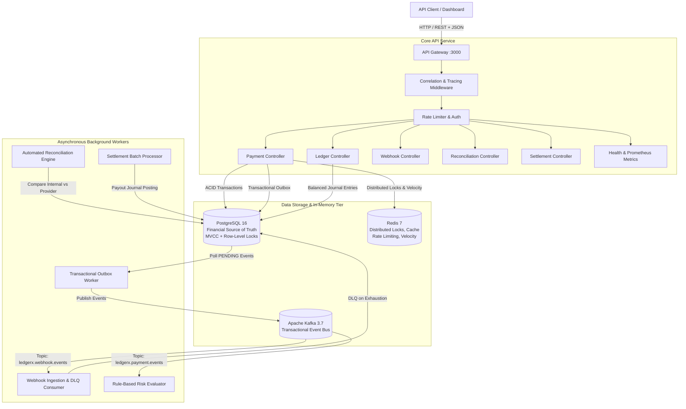
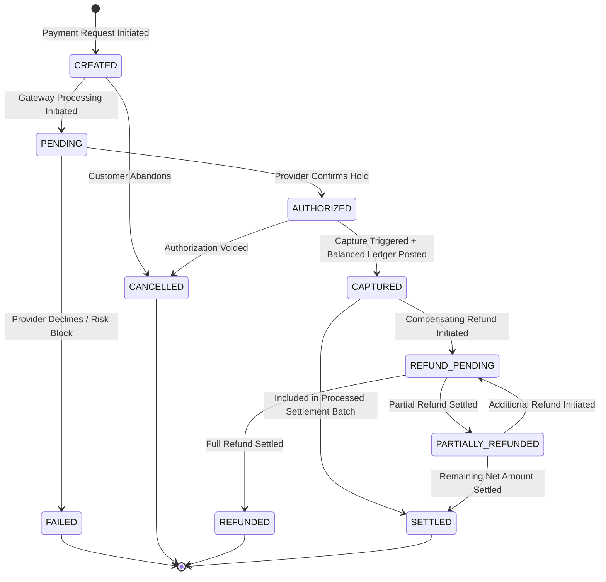
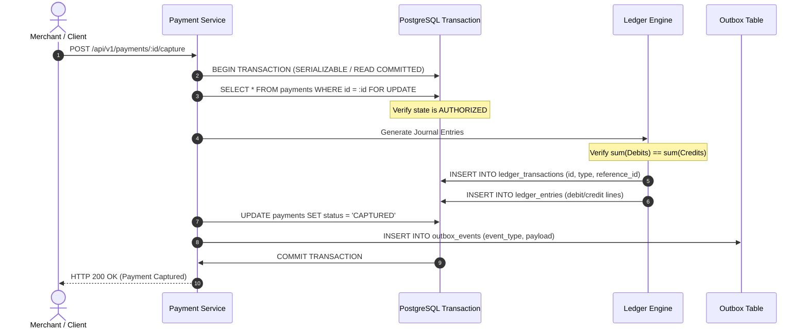
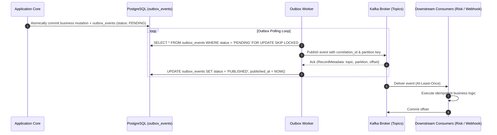
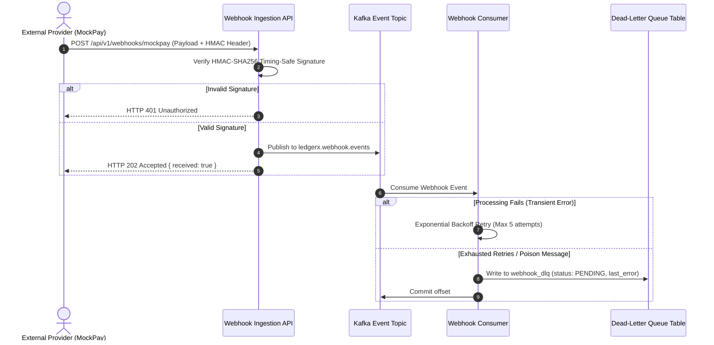
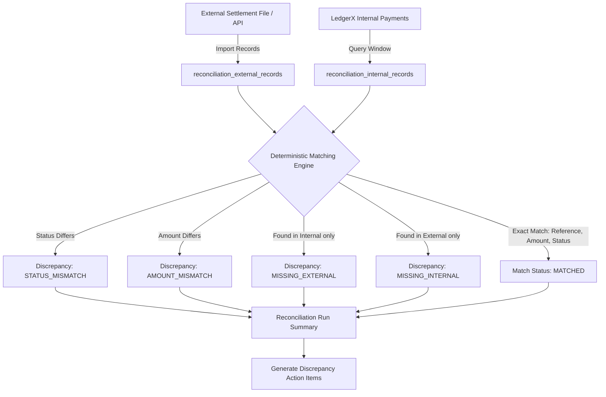
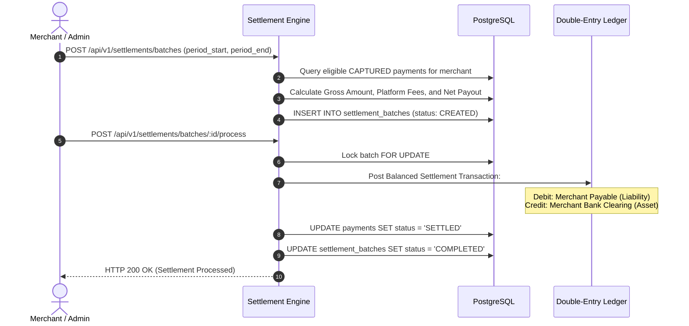

# LedgerX Architecture Specification

## 1. System Overview

LedgerX is a mission-critical payment infrastructure and automated financial reconciliation platform designed with double-entry accounting correctness, deterministic reconciliation, strict idempotency, transactional outbox messaging, and distributed fault tolerance.

### 1.1 Architecture Diagram

---

## 2. Payment Lifecycle & State Machine

Payments advance through a deterministic, strictly validated finite state machine.

### 2.1 State Transitions

### 2.2 Payment Capture & Double-Entry Ledger Coordination

When a payment is captured (`POST /api/v1/payments/:id/capture`):
1. **Pessimistic Row-Level Lock**: PostgreSQL `SELECT ... FOR UPDATE` row locks serialize concurrent capture attempts.
2. **State Verification**: Asserts current status is `AUTHORIZED`.
3. **Double-Entry Journal Entry Generation**:
   - Debit: Merchant Settlement Receivable (Asset account) `+Amount`
   - Credit: Platform Payment Clearing (Clearing account) `+Amount`
4. **Invariant Check**: $\sum \text{Debits} = \sum \text{Credits}$ verified before commit.
5. **Transactional Outbox Event**: `payment.captured` event inserted into `outbox_events` in the same database transaction.

---

## 3. Double-Entry Accounting Core

Financial transactions in LedgerX strictly conform to classic double-entry bookkeeping:

### Double-Entry Invariants
1. **Balance Invariant**:
   $$\sum \text{Debits} = \sum \text{Credits}$$
   Every transaction requires at least 2 entries. If total debits do not equal total credits, the transaction fails and rolls back completely with `FinancialInvarianceError`.
2. **Append-Only Immutability**:
   Historical ledger entries and transactions are immutable. No `UPDATE` or `DELETE` operations are exposed. Financial corrections require a new compensating transaction.
3. **Reference Uniqueness**:
   A PostgreSQL unique constraint `UNIQUE (reference_type, reference_id)` on `ledger_transactions` ensures one financial event (such as a payment capture) can never post duplicate ledger transactions.
4. **Positive Amounts**:
   All entries enforce `amount_minor > 0` at both application and database level (`CHECK (amount_minor > 0)`).

---

## 4. Asynchronous Event Flow & Transactional Outbox

To guarantee reliable messaging without dual-write consistency issues, LedgerX implements the **Transactional Outbox Pattern**.

---

## 5. Webhook Ingestion, Retries & Dead-Letter Queue (DLQ)

---

## 6. Automated Financial Reconciliation Flow

The reconciliation engine detects discrepancies between LedgerX internal records and external provider settlement files.

---

## 7. Settlement & Settlement Batch Execution Flow

---

## 8. Failure Handling & Consistency Guarantees

| Subsystem | Delivery / Execution Semantics | Authoritative Store | Failure Behavior |
| :--- | :--- | :--- | :--- |
| **Payment State Transitions** | Exactly-once via PostgreSQL row locks & unique idempotency keys | PostgreSQL | ACID rollback; zero side effects |
| **Double-Entry Ledger** | Exactly-once; Balanced journal entries | PostgreSQL | Transaction rolls back if debits $\ne$ credits |
| **Outbox Events** | At-least-once to Kafka | PostgreSQL | Polling worker retries until broker ack |
| **Kafka Consumers** | Effectively-once via Idempotent consumer logic | PostgreSQL | Offsets committed only after DB update |
| **Redis Cache / Locks** | Non-authoritative cache & concurrency control | Non-authoritative | Graceful degradation; DB remains ground truth |
| **Reconciliation** | Deterministic batch processing | PostgreSQL | Discrepancies logged; manual resolution workflows |
